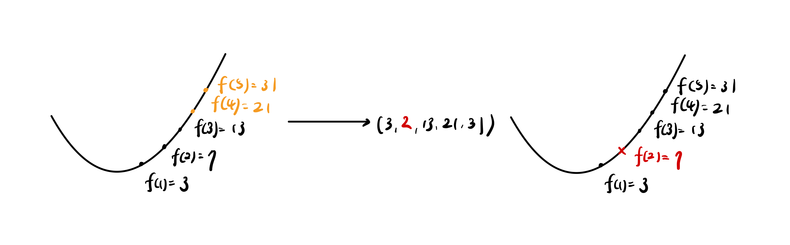

# PCS: Binius explained 
本文將介紹由 Irreducible (原Ulvetanna) 所提出的 binary field 中建立 SNARK 的方法 Binius。

Photo by <a href="https://unsplash.com/@eva_gorobets_?utm_content=creditCopyText&utm_medium=referral&utm_source=unsplash">Eva Gorobets</a> on <a href="https://unsplash.com/photos/gray-and-black-textile-on-white-surface-vJ4NYVIhQpU?utm_content=creditCopyText&utm_medium=referral&utm_source=unsplash">Unsplash</a>
 
## table of contents.
- Intro.
- A little recap of PCS
- Binary Tower
- Reed-Solomon erasure code
- Kronecker product
- Binius example by Vitalik
- Summary
- Ref.
 
## Introduction
傳統的 SNARK 通常會在 256 位元以上的有限體中做運算，為了在這麼大的有限體中做運算，電路中的數字就必須用這麼多的空間來儲存，你可以想像在你的電路當中有一堆 1 佔用了 256 位元會有多浪費空間。

那麼既然在那麼大的有限體中運算很耗資源，我們為什麼不將有限體縮小，縮小到極致，也就是只剩下 0 跟 1 的 binary field（GF(2)）。而 Binius 就是在 binary field 中運算的 SNARK，更準確地來說，Binius 是在 binary field 中的 polynomial commitment scheme。

## A little recap of PCS
現代組成 SNARK 的方式是把 IOP (Interactive oracle proof) 和 PCS (Polynomial commitment scheme) 結合在一起，其中我要講的是 polynomial commitment。

Polynomial commitment 是一個可以代表多項式的表示方法。Prover 可以將一個多項式 commit 成一個 polynomial commitment，並在之後向 verifier 證明這個多項式上的某個點的值，而不用公開整個多項式。

而證明的方式會使用高中學過的餘式定理，如果我要證明 $P(z) = a$，那我只需要證明 $\frac{P(x)-a}{x-z}$ 是一個多項式就好了。原因如下，如果 $P(z) = a$，那麼根據餘式定理就滿足 $P(z)=(x-z)\cdot q(x)+a$，經過一番移項會得到$\frac{P(z)-a}{x-z}=q(x)$，也就是以上說的$\frac{P(x)-a}{x-z}$ 是一個多項式。

簡單回顧一下 KZG commitment。

KZG 的第一個步驟是 trusted setup，由一個或多個人完成。先取一個秘密 $s$，（這個秘密 $s$ 在完成 trusted setup 之後要被丟棄），以及兩個橢圓曲線的 Generator $G_1$ 和 $G_2$，創造出兩組數列 $[G_1, G_1\cdot s, G_1\cdot s^2, ..., G_1 \cdot s^n]$、$[G_2, G_2\cdot s, G_2\cdot s^2, ..., G_2 \cdot s^n]$，這些數字被稱為 proving keys。

第二個步驟是 commit。 Prover 將多項式 $P$ 轉換成 commitment，方法是將原多項式的 $x^n$ 以 $G_1\cdot s^n$ 代換掉。我們用 $[P]$ 來代表 $P$ 的 commitment。

最後一步是證明，Verifier 只要確認兩組橢圓曲線上的 Pairing 相等，就能被說服 $P(z)=a$。

由於 KZG 並不是本文重點，所以就不多做背後數學邏輯的解釋，讀者只需要知道 Polynomial commitment 的用途即可。

## Binary Tower
這部分會碰到比較難懂的抽象代數，而Binius又在這之上進行了改良，由最基本由 0 和 1 組成的 binary field（Galois Field $GF(2)$）, 進一步延伸出 $GF(2^n)$。

最傳統的$GF(2^n)$ 使用的是單變數的多項式運算，而為了加速運算，Binius 將單變數運算改成了多變數運算，變成了所謂的 binary tower  (出自[An iterated quadratic extension of GF(2) by Weidemann(1986)](https://www.fq.math.ca/Scanned/26-4/wiedemann.pdf))。

我們會從最基本的binary field 開始介紹，我相信這樣會更容易理解 binary tower 在做什麼。

### binary field

有限體（域） Finite Fields，又稱 Galois Fields，時常簡寫為 $GF(p)$，代表的是一個由 $1$ 到 $p-1$ 所組成的集合，所有在這個有限體中的運算都要 $mod\ p$。在這裡需要注意的是 Galois Field 的 $p$ 必須是質數或是質數的某個次方。舉個例子來說，$GF(7)$ 由 $Z_7 = \{0,1,2,...,6\}$ 組成，其中所有的運算都要除以 $7$ 取餘數，也就限制了所有運算的結果最終都會回到這個集合內。

Binary Field，也就是 $GF(2)$，只由兩個元素 $\{0,1\}$ 組成，所有運算的結果都是 0 或 1，我們可以將所有運算寫在下表，左邊是加法，右邊是乘法：

你可以發現在 binary field 中的加法就是 XOR ，更方便的事情是減法就是加法。我們會想要在所有運算中擁有這些優點，這會讓運算速度非常快。

那麼如果我們今天想要處理 3 個 bit 的運算時，也就是我想要在 $Z_8 = \{0,1,2,3,...,7\}$ 中做運算時會發生什麼問題（這裡不能寫 $GF(8)$ 因為 $p$ 必須是質數）。

如果你像上面一樣把整個加法表跟乘法表寫出來，你會發現在加法表裡面沒什麼問題，在乘法表裡就會出問題了。在乘法表中，所有數字的出現頻率是不一樣的，也就是說如果你的加密系統建立在這樣的“有限體”中（當然他不能被稱為有限體），攻擊者有很高的機率可以利用頻率分析來破解。第二個問題是，在這樣的“有限體”當中，某些元素不存在乘法反元素，也就是不能進行除法。

為了解決這樣結構的缺陷，又想要保留加法跟減法都是 XOR 的優點，我們需要介紹 $GF(2)$ 的擴展域 $GF(2^n)$。

### extension field

$GF(2^n)$ 是 $GF(2)$ 的擴展域，包含 $2^n$ 個元素，每個元素可以用長度為 n 的二進位數表示。舉個例子：$GF(2^3)$，由 $\{000,001,010,011,100,101,110,111\}$ 組成，你會想說這跟原本的有限體差在哪，不就是把原本的數字轉成二進位表示法。其實不太一樣，在這裡我會建議大家先不要把他看成是一個二進位表示法，111 就是 111，不要想成 7（雖然後面我們還是會這麼做），因為每一個位元代表的是一個多項式的係數。加法跟乘法都不是原先想像的加法跟乘法，且運算仍然是二進制的。

先跳到結論，這樣的建構可以讓乘法表中的每個數字出現頻率相等、每個元素都有相對應的乘法反元素、並且加法等同於減法。

在這樣的有限體當中，每一個元素都被看成是一個多項式，其中每個位元代表的是 $x$ 的某個次方的係數。這有點像是小時候剛學多項式的除法時，我們為了簡化只會寫多項式的係數一樣。所以在 $GF(2^3)$ 中的元素，其實是如下表所示的多項式。

寫成這樣之後就好解釋了，只要把兩個數字都變成多項式，再進行加法跟減法，並且記得使用二進位，運算結果再變回係數表示法，所有的運算都會變得非常合理。

加法的部分比較簡單，我舉了個例子如下。應該不難看出，加法的結論就是XOR。
$$\begin{aligned}
111+101 &= (x^2+x+1)+(x^2+1) \\
&= 2x^2+x+2 \\
&=x \\
&= 010
\end{aligned}$$

乘法的部分比較複雜一點點，但只要帶入不可約多項式（Irreducible polynomial）的概念，所有問題都會迎刃而解。不可約多項式其實就是在這個有限體中的模數。在原本的有限體中我們 mod p，而在擴展域中我們就 mod 不可約多項式。在這個例子當中，$x^3+x+1$ 就是不可約多項式。

透過這樣的運算，我們可以寫出整張加法表和乘法表，再把二進位數字的想法搬回來（111=7）。就會出現 $7+5=2$, $7*5=6$ 這樣，看似奇怪但很合理的結果。

### binary tower

我們定義另外一種 binary field 的建構方式，稱之為 binary tower。之所以叫做 tower，是因為每個擴展域都像是上一個擴展域疊加上去，$F_{2^{128}}$ 像是兩個 $F_{2^{64}}$ 結合在一起，而 $F_{2^{64}}$ 又像是兩個 $F_{2^{32}}$ 結合在一起，這樣一層一層的感覺就好像一個塔一樣。你可以一直無限疊加上去，端看你的需求。

跟原本的 $GF(2^n)$ 一樣，每一個位元都表示著一個小的多項式，只是在 binary tower 中，這個小多項式是多變量的，也就是由 $x_0, x_1, x_2,...,x_k$ 組成。

在 binary tower 當中的每個元素可以表示成左半邊加上右半邊乘上 $x_k$，舉個例子來說：
$$11001010=1100+1010*x_2$$
而其中的 1100 跟 1010 又可以切成一半：
$$11001010= 11+10*x_1+ 10*x_2+10*x_1x_2$$
再切一半就可以得到：
$$11001010=1+x_0+x_2+x_1x_2$$

利用同用的算法，我們可以算出每一個位元所代表的多項式，我畫了一張圖希望更能體現那種塔的感覺，也順便標示出在每個擴展域當中的各個位元代表的多項式是什麼：

而這麼做的好處在於，當我要進行乘法的時候，我可以將兩個數字都拆成更小的兩個數字，彼此做相乘，然後再拆成更小的數字，這樣無限遞迴下去，最後用很簡單的數字完成乘法。

（screenshot from https://www.youtube.com/watch?v=eTCjVTWqjj0）

那在這之中會產生一個問題就是，如果次方超過的話怎麼辦。如同上面的解法，我們同樣要定義不可約多項式。換個表示方法，就是把那些有次方的數代換掉：
- $x_0^2=x_0+1$
- $x_1^2=x_1x_0+1$
- $x_2^2=x_2x_1+1$
- ...

所以舉個例子：
$$\begin{aligned}
5*4 &= 101*001 \\
&=(1+x_1)*x_1 \\
&= x_1+x_1^2 \\
&= x_1+x_1x_0+1 \\
&= 1011 \\
&= 13
\end{aligned}$$

補充說明一下，這裡的二進制表示方法是顛倒過來的，所以 001 代表的是 4 不是 1。那麼根據這樣的算法我們可以寫出 $F(2^4)$ 之間的加法表和乘法表。讀者可以在表中挑一個來手算看看，想信會更容易理解：

(screenshot from vitalik's website)

使用有別於傳統建構方式的 binary tower 可以更有效的支援各種長度資料之間的運算，在這裡我指的是不同 data type 的長度，1 可以就是 1 位元，不用塞到一個 256 位元的空間中。

## Reed-Solomon erasure code

Reed-Solomon (以下簡稱RS) 是一種錯誤更正碼（Error Correction Codes），所謂的錯誤更正碼是一種用於在數據傳輸和存儲過程中檢測和糾正錯誤的技術。在數據傳輸或儲存過程中，由於噪音、干擾或其他原因，可能會發生數據的損壞，而我們會利用錯誤更正碼來多傳一些附加的資訊，讓我們可以利用這個資訊檢測並將損壞的數據回復成正確的資訊。

RS 的做法是將要傳的數據看成直角坐標上的點，將這些點計算成為一個唯一的多項式(用拉格朗日插值法)，並多傳幾個多項式上的點作為更正碼。這樣一來收到數據的人就可以利用多傳的更正碼還原出原始的多項式，並檢查出數據是否有損壞。能承受幾個數據損壞由多傳了幾個數據來決定。

### Lagrange Interpolation
這裡簡單解釋一下拉格朗日插值（Lagrange Interpolation）。給定k+1個點，你可以寫出一個唯一的多項式：
$$L(x) = \sum_{j=0}^ky_jl_j(x) $$

其中

$$l_j(x)=\prod_{i=0, i\neq j}^k \frac{x-x_i}{x_j-x_i}$$

舉個例子：

$$f(1) = 2,\
f(3) = 2,\ f(4) = -1$$

你可以得到：

$$\begin{aligned}
l_0(x) = \prod_{\substack{i=0 \\ i \neq 0}}^2 \frac{x - x_i}{x_0 - x_i} = \frac{(x - 3)(x - 4)}{(1 - 3)(1 - 4)} \\ l_1(x) = \prod_{\substack{i=0 \\ i \neq 1}}^2 \frac{x - x_i}{x_1 - x_i} = \frac{(x - 1)(x - 4)}{(3 - 1)(3 - 4)} \\
l_2(x) = \prod_{\substack{i=0 \\ i \neq 2}}^2 \frac{x - x_i}{x_2 - x_i} = \frac{(x - 1)(x - 3)}{(4 - 1)(4 - 3)}
\end{aligned}$$

最後組起來：

$$\begin{aligned} 
L(x) &= 2 \cdot l_0(x) + 2 \cdot l_1(x) + (-1) \cdot l_2(x) \\
&= 2 \cdot \left(\frac{(x - 3)(x - 4)}{6}\right) + 2 \cdot \left(-\frac{(x - 1)(x - 4)}{2}\right) - \frac{(x - 1)(x - 3)}{3} \\
&= \frac{(x - 3)(x - 4)}{3} - (x - 1)(x - 4) - \frac{(x - 1)(x - 3)}{3} \\
&= -x+4x-1
\end{aligned}$$

透過拉格朗日差值法，我們可以在給定任意數量的點時快速的算出唯一的多項式。

### a RS example
現在假設我們要傳的資料是 (3, 7, 13)，我們可以讓要傳的資料剛好是某個多項式代 1,2,3 時的值。也就是我們令一個方程式的：
$$f(1) = 3,\ f(2) = 7,\ f(3) = 13$$
用拉格朗日插值我們可以得到這個二次方程式是 $x^2+x+1$。接著我們算出另外兩個點（或更多個點）：
$$f(4)=21, f(5)=31$$
接著把（3,7,13,21,31) 一併傳出去，這麼一來，只要傳送過程中資料損壞數量在2以下，我們就有能力算出同一個多項式並把數據還原回來。比如說今天的第二個數據在傳送過程中不小心從 7 變成了 2，我就可以用其他幾個點算出原本的 7 (嚴格說起來只需要額外的一個點):

## Kronecker product
這裡介紹一個 Binius 會用到的小小數學工具，Kronecker product。

Kronecker product 是對兩個任意大小的矩陣之間的運算，他是一種張量積（tensor product）的特化，以 $\otimes$ 表示。Kronecker product 會用兩個矩陣生成一個更大的矩陣。舉個簡單的例子，如果 A 和 B 分別是：
$$
A = \begin{bmatrix} 
1 & 2 \\
3 & 4 
\end{bmatrix}, \quad
B = \begin{bmatrix} 
0 & 5 \\
6 & 7 
\end{bmatrix}
$$

那麼它們的 Kronecker product $A \otimes B$ 為：
$$
A \otimes B = \begin{bmatrix} 
1 \cdot B & 2 \cdot B \\
3 \cdot B & 4 \cdot B 
\end{bmatrix}
= \begin{bmatrix} 
0 & 5 & 0 & 10 \\
6 & 7 & 12 & 14 \\
0 & 15 & 0 & 20 \\
18 & 21 & 24 & 28 
\end{bmatrix}
$$

其實他的概念就是把兩個矩陣中的元素兩兩相乘，變成一個更大的矩陣而已。
在 Binius 中我們只會用到兩個陣列中的 Kronecker product，所以其實只需要了解底下這個例子即可：
$$
\begin{aligned} 
\ [1,2] \otimes [3,4] 
&= [1\cdot3,\  2\cdot3,\ 1 \cdot 4,\ 2 \cdot 4] \\
&= [3,6,4,8]
\end{aligned}
$$

## Binius example by Vitalik
在這裡介紹 Binius 的整個流程。如果有確實搞懂上面所說的幾個概念的話，這張圖基本上可以秒殺。我們來一個步驟一個步驟看。

(screenshot from vitalik's post)

不同於 KZG commitment scheme，Binius 使用的是多變量的多項式，也就是說要 commit 的多項式不只是平面上的一個曲線，而是一個超方形（hypercube）。你只要想像成原本 commit 的多項式是 $f(x)$，而現在則是 $f(x_1,x_2,x_3,x_4)$。只是前者圖像化之後是一個平面上的曲線，後者則是一個五維超方形中的四維超方形。

我們首先將這個超方形拍平成一個 4*4 的表（左上角 Flatten 的部分）。在真實的 Binius 將會是一個更大的表，不過為了方便解釋，我們先拿一個小例子來說明。

接著我們將拍平後的表兩兩看作一組，在更大的 binary field 中做 Reed Solomon extension，之後再把 extend 的結果變回 binary。舉例來說第一列 $[0,0,1,1]$ 看成 $[00,11]=[0,3]$，對其做 RS，也就是把它看成 $y=3x$，得到 $x$ 代 2 跟 3 的值 $[1,2]$ 再把他轉換回 $[1,0,0,1]$。依序對每一列做這樣的事情。注意到，在這個例子中的所有數字運算都是在 $GF(2^2)$ 之中，所有的乘法跟加法都是使用 binary tower 之中多變量的運算，所以如果你想用手算的話，查表比較快。

最後將每一行看作是 merkle tree 的 leaf，算出一個 merkle root，就可以得到運用 binius 運算的 commitment。

接著當 prover 要證明在這個 hypercube 之中點 $r=(r_0, r_1,r_2,r_3)=(2,0,3,4)$ 的值是 14，也就是 $f(2,0,3,4)=14$ ，的時候，他會需要做一些運算。

首先他取後面兩位 $(r_2,r_3)=(3,4)$，運算 $(1+r_2,r_2) \otimes(1+r_3, r_3)=(2,3) \otimes(5,4)=(10,15,8,12)$。接著我們將得到的陣列跟拍平後的表格相乘得到 $[11,4,6,1]$：
$$
\begin{aligned}\
[0,0,1,1]*10+  \\
[1,0,0,1]*15+ \\
[1,1,0,1]*\ \ 8+ \\
[1,1,1,1]*12= \\
[11,4,6,1]
\end{aligned}
$$

Prover 將 $[11,4,6,1]$ 、以及 RS 後的表格中隨機挑選的幾行數字及其 merkle proof 傳給 Verifier 作為 proof。在這個例子我們選最後一行給 Verifier 驗證。

Verifier 要做的驗證有兩個，第一個是驗證 merkle root 的正確性。Verifier 拿 Prover 提供的陣列 $[11,4,6,1]$ 進行 RS、以及拿 Prover 隨機挑選的幾行RS後的表格乘上$[10,15,8,12]$ (Verifier 可以自己算這個)，這兩者算出的結果應該要一樣。如果一樣就說明 merkle root 是正確的。

Verifier 要做的第二個驗證是驗證 $(2,0,3,4)$ 的值真的是 14。他要拿
首先他取前面兩位 $(2,0)$，運算 $(1+r_0,r_0) \otimes(1+r_1, r_1)=(3, 2) \otimes(1,0)=(3,2,0,0)$，接著和 Prover 提供的 $[11,4,6,1]$ 相乘得到 $3*11+2*4 = 14$。證明了 Prover 所說的 （2,0,3,4） 的值是 14。這樣就完成了整個證明的過程。

那麼現在再回來看這張圖，讀者應該可以完全知道裡面的每一個過程跟數字是怎麼來的。

(screenshot from vitalik's post)

## Summary

Binius 透過在 $GF(2^n)$ 中運算，可以有效的減少空間的浪費，並且在表現上比 plonky2 快了 50 倍。

在四月的時候，Irreducible 又推出了一版 FRI-Binius，將原本用 Brakedown 改良的 Binius 改成結合 FRI 和 BaseFold，降低了整個 proof size。而在今年七月的時候，Irreducible 更宣布要和 Polygon Labs 合作建立 Binius-based zkVM。之後應該會有更多與 Binius 結合的成品出現。

## Reference.
- [Binius blog post by Irreducible](https://www.irreducible.com/posts/binius-hardware-optimized-snark)
- [Binius research paper](https://eprint.iacr.org/2023/1784)
- [Binius explained by Ben Diamond (video)](https://www.youtube.com/watch?v=eTCjVTWqjj0)
- [Binius explained by Vitalik](https://vitalik.eth.limo/general/2024/04/29/binius.html)
- [Understanding PLONK](https://vitalik.eth.limo/general/2019/09/22/plonk.html)